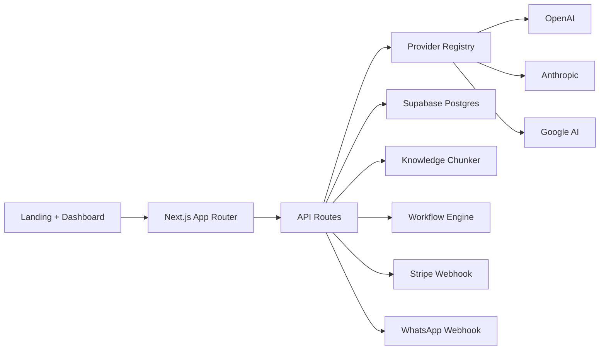

# AI Workforce OS

A launch-ready SaaS starter to sell AI agents, workflows and knowledge systems as a premium product.

## Positioning

This project is not framed as "another AI chat app".  
It is a business operating system that lets customers deploy:

- sales recovery agents
- content production agents
- operations copilots
- knowledge-driven workflow automation

That positioning is stronger for pricing, retention and expansion.

## Stack

- Next.js 16 App Router
- React 19
- Tailwind CSS
- Supabase (Auth, Postgres, Storage, Realtime)
- OpenAI / Anthropic / Google provider-ready adapter layer

Next.js App Router is the recommended modern router in the official docs, while Supabase documents Auth, Postgres, Storage and vector embeddings as platform features for production apps.

## What is included

- modern landing page
- responsive dashboard
- agent catalog
- conversation center
- knowledge brain UI
- workflow engine UI
- integrations page
- billing page
- API routes for health, agents, knowledge chunking, workflow testing and webhook placeholders
- Supabase SQL schema starter
- environment template
- scalable folder structure

## What still needs to be connected before production

- real authentication flows
- persistent database reads/writes
- Stripe checkout + customer portal
- WhatsApp Cloud API send/receive mapping
- vector embeddings insert + retrieval
- role-based permissions
- audit logs
- usage metering
- multilingual copy polish

## Best monetization model

1. Setup fee  
   Charge onboarding and knowledge-base setup.

2. Monthly SaaS  
   Charge recurring for agent usage, workflows and seats.

3. Managed service layer  
   Offer premium done-for-you operation for clients who want performance, not tools.

## Recommended niche-first launch

Start selling the first packaged use case before expanding:

- Recover lost leads
- Reactivate silent prospects
- Qualify inbound requests
- Draft proposals and content using business knowledge

## Database setup

1. Create a Supabase project.
2. Run `supabase/schema.sql` in the SQL editor.
3. Add the values to `.env.local`.

Supabase documents Auth and Next.js integration in its official quickstarts and tutorials.

## Local install

```bash
npm install
cp .env.example .env.local
npm run dev
```

## Deployment

### Vercel
- import this repository
- add environment variables
- deploy

### Supabase
- create project
- run SQL schema
- enable Storage bucket for uploads
- configure auth providers

### Stripe
- create products and prices
- add webhook to `/api/webhooks/stripe`

### WhatsApp
- create Meta app
- set verify token
- point webhook to `/api/webhooks/whatsapp`

## Architecture



## How to sell this fast

### Offer 1
“We install an AI sales recovery operator in your business in 48 hours.”

### Offer 2
“We build your AI content and operations team inside one dashboard.”

### Sales motion
- short demo video
- before/after lead recovery proof
- onboarding call
- installation fee + monthly plan

## Important note about the uploaded prompt archive

The uploaded archive is best used as inspiration for system design, orchestration patterns and product positioning.  
Do not treat leaked or third-party prompt text as your actual product moat. Your moat should be:

- customer data
- execution workflows
- integrations
- onboarding
- speed to ROI
- vertical specialization

## Suggested next build steps

- wire the dashboard to real Supabase tables
- add login and protected routes
- implement Stripe checkout
- implement a production knowledge retrieval layer
- add a workflow builder UI with save/edit actions
- create a white-label mode for agencies
